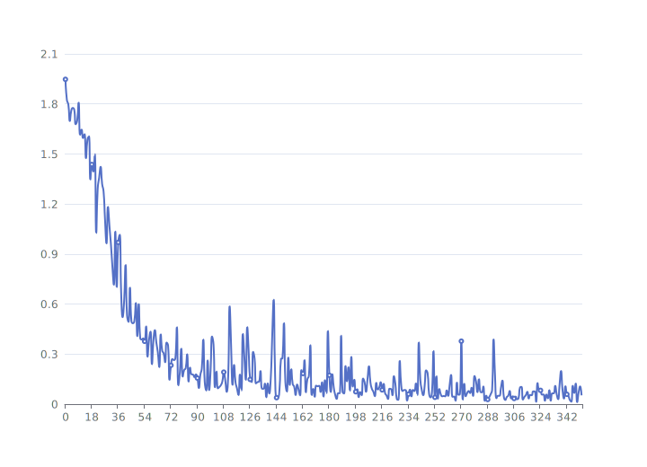

## competiton

You can download the dataset in the Kaggle competition

https://www.kaggle.com/competitions/expertclass2

## compare

| Model            | Private Score | Public Score | FLOPs    | params   |
| ---------------- | ------------- | ------------ | -------- | -------- |
| MobileNetV1      | 0.37542       | 0.38347      | 106.785M | 3.339M   |
| MobileNetV2      | 0.33030       | 0.32898      | 17.951M  | 2.233M   |
| MobileNetV3Large | 0.33030       | 0.32869      | 14.884M  | 3.963M   |
| MobileNetV3Small | 0.32746       | 0.31989      | 4.545M   | 1.525M   |
| Vgg19            | 0.57746       | 0.57479      | 1.015G   | 139.599M |
| ResNet50         | 0.48098       | 0.45302      | 215.137M | 23.522M  |

## loss

### MobileNetV1

### MobileNetV2

### MobileNetV3Large

### MobileNetV3Small

### Vgg19

### ResNet50

